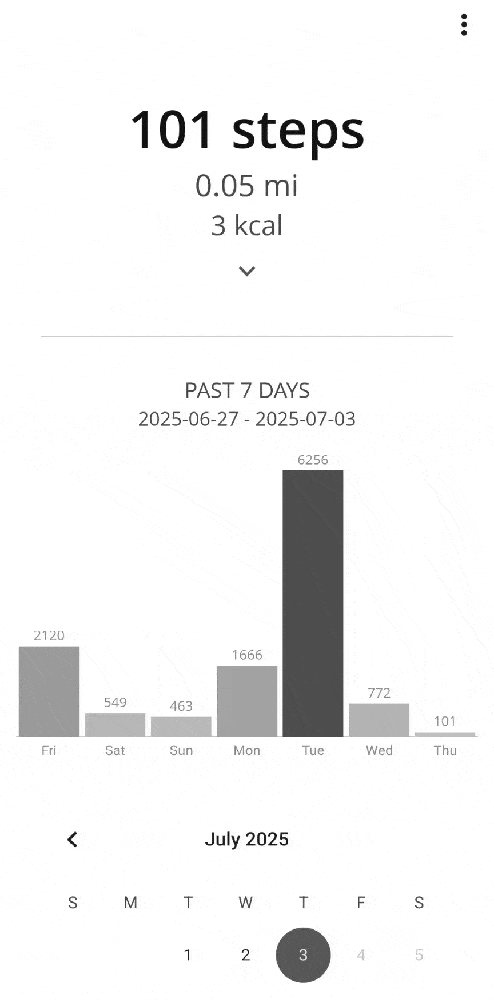
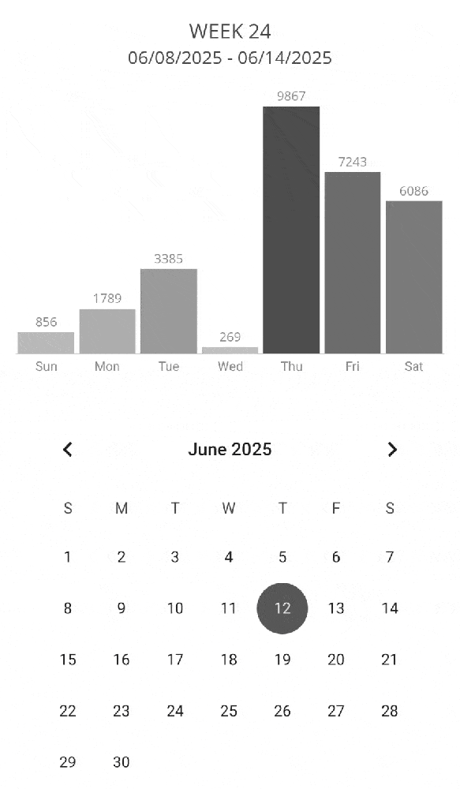

# Tips and Tricks

Stepsy is built with simplicity in mind: it counts your steps and presents your data clearly. However, there are a few handy features you may have missed.

## Adjust Today's Step Count

You can manually adjust today's step count by long-pressing the **Today's Count** label and entering a custom value. This is useful if your phone wasn’t with you during a walk or if you forgot to pause tracking during an activity like a morning run.  

## Toggle Chart Range Views

Tap the **"Past 7 Days"** or **"Week #"** label above the chart to switch between different time views. This lets you quickly compare a rolling 7-day summary with calendar-based weekly stats.

## Step Goal Reached Notification

Enable a notification to be alerted when you reach your custom daily step goal. You can set your target step count and get notified as soon as it's achieved—perfect for focused sessions like walking pad workouts or structured training goals.

To enable or disable this feature, go to **Three-dot menu › Achievements**.

## Set Up Automatic Backups

Keep your step data safe with recurring backups. You can configure the app to automatically back up your data every 1–30 days at midnight. Choose a destination folder, define how many past backups to keep, and export a backup manually at any time if needed.

Access this feature via **Three-dot menu › Backup**.

## Adjust Step Length

By default, the app estimates your step length using your height (`height × 0.414`) to calculate distance. However, you can manually override this value in the **Step Length** setting.

This is helpful if you've measured your actual stride length or if your walking style differs from average—due to training routines, physical differences, or personal calibration needs.

Find this option under **Three-dot menu › Settings**.
